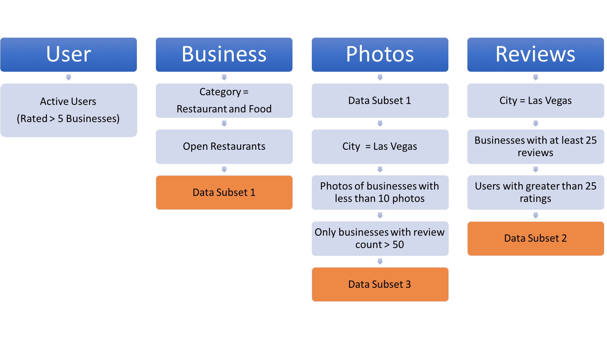

# Yelp Data Recommendation System

1. Introduction

In today’s world, where data has become the new oil, recommendation systems has taken a huge leap in terms of research and real time implementation. 

With the growing technology industry, the amount of competition between these companies to retain users has grown tremendously. Everyone is behind personalizing their experiences based on the user so that the user actually comes back to their side. In today’s day and age, the number of applications and websites has increased tremendously. Especially in the area of restaurants. In the US, Yelp has become very famous for finding any kind of restaurant for breakfast, lunch or dinner. In does not stop there, we can even find pubs and cafes depending on our taste and interest.

In this task, we try and build a recommendation system for our users on Yelp using the Yelp Dataset from the Yelp Challenge 2019. 

2. Business Rule

Let's take a minute here to understand how we are going ahead with our recommendation task and what business rules are we applying here. 
The main task here is to predict the last rating that the user gave to a particular business. To go about predicting the rating, we are using the previous user data that has been given to us. We are not only using the ratings that the user gave to multiple businesses but also using the other features about users and businesses given to us. 
To try out something more interesting we also used the reviews as well as images given to businesses. 
Before we jump to understand how we used the last predicted rating to recommend we will define our first business rule. 
If a user has rated a business with rating greater than or equal to 2.5, then we say that the user liked the particular business, or else we take it that he disliked the business.

Now, if the user has rated a business with a rating greater than or equal to 2.5, and we predict the rating to be greater than 2.5 then we say that this a true positive. Similarly we are defining the accuracy metrics like precision and recall. More about these in the evaluation metrics section.

In the recommendation task we are recommending businesses that are similar to the last business the user has rated of the user liked the last business he rated, otherwise we are giving him top 5 recommendations through ALS based model.

3. Data Sampling

Before we jump into the implementation of these systems, we would like to discuss how we have sampled our data. 
We have mentioned most of our sampling in the data analysis section, but here we will explain the different samples used in our models. 
We had to take three different subsets in our case as each of the model had their own requirements. Due to time and memory constraints we had to use a smaller subset while running our model which was business reviews and an even smaller dataset for the model which uses business photos.

4. Recommendation Systems

Now let's talk about how we are predicting the user’s last rating. As mentioned above we are using the following information given to us to go about the prediction task - 

-> Baseline 

-> ALS using Spark Machine Learning library 

-> Similarity in Businesses using features like Categories - Factorization Machine 

-> Reviews given by users to different businesses - Review based Recommendation using NLP 

-> Images of the businesses - Images based Recommendation using Image Embeddings 

-> Ensemble techniques

This is an overall explanation of what will be doing for the prediction.

The report added above will give an in depth explanation of the entire process. 
Thank you!
